# Voice Reseller Agent MVP

A specialized implementation of a voice-to-voice AI sales agent, designed to demonstrate a "Microservices" approach to building custom voice bots. This MVP bridges a custom web frontend with low-code orchestration tools (**n8n**) and an LLM brain (**Flowise**).


## 🏗 Architecture

The system uses a modular architecture to separate **Transport**, **Orchestration**, and **Intelligence**.

```mermaid
sequenceDiagram
    participant User as 🗣️ User (Web/Voice)
    participant Gateway as 🚪 Node.js Gateway
    participant n8n as ⚙️ n8n Workflow
    participant Flowise as 🧠 Flowise Brain

    User->>Gateway: POST /talk (Audio Blob)
    Gateway->>n8n: Forward Audio (Webhook)
    n8n->>n8n: STT (Whisper Node)
    n8n->>Flowise: HTTP POST (Text Query)
    Flowise-->>n8n: JSON (Sales Text Response)
    n8n->>n8n: TTS (Text-to-Speech Node)
    n8n-->>Gateway: Binary Audio
    Gateway-->>User: Play Audio
```



### Components

1.  **Backend Gateway (`/backend`)**: A lightweight Express.js server that serves the frontend, handles audio uploads (`multer`), and proxies authentic requests to your automation cloud. It hides the complexity (and API keys) of n8n from the client.
2.  **Frontend (`/public`)**: A zero-dependency HTML/JS interface using the native `MediaRecorder` API to capture microphone input and play back responses.
3.  **Blueprints (`/blueprints`)**: JSON schemas to instantly spin up the logic in n8n and Flowise.

---

## 🚀 Getting Started

### Prerequisites

*   [Node.js](https://nodejs.org/) (v18 or higher)
*   An instance of [n8n](https://n8n.io/) (Cloud or Self-hosted)
*   An instance of [Flowise](https://flowiseai.com/) (Local or Cloud)
*   OpenAI API Key (for STT/TTS in n8n)

### 1. Installation

Clone the repository:
```bash
git clone https://github.com/your-username/voice-reseller-mvp.git
cd voice-reseller-mvp
```

Install backend dependencies:
```bash
cd backend
npm install
```

### 2. Configuration

Create your environment file:
```bash
cp .env.example .env
```

Edit `.env` to configure your modes:

```ini
PORT=3000
# Set to 'false' when you have n8n running. 
# Set to 'true' to test the audio-loop without consuming API credits.
MOCK_MODE=true 

# Your n8n Webhook URL (Production)
N8N_WEBHOOK_URL=http://localhost:5678/webhook/voice-input
```

### 3. Logic Setup (The "Brains")

The logic is defined in JSON blueprints found in the `blueprints/` folder.

#### **Step A: Flowise (The Sales Logic)**
1.  Open Flowise.
2.  Go to **Chatflows** > **Add New** > **Load**.
3.  Upload `blueprints/flowise_chatflow.json`.
4.  **Important:** Add your OpenAI Key to the `ChatOpenAI` node credentials.
5.  Save and Note the **API Endpoint URL** (e.g., `http://localhost:3000/api/v1/prediction/abc-123`).

#### **Step B: n8n (The Orchestrator)**
1.  Open n8n.
2.  Create a new workflow -> **Import from File**.
3.  Select `blueprints/n8n_workflow.json`.
4.  **Configure Nodes:**
    *   **Whisper (STT):** Add your OpenAI credentials.
    *   **Flowise (HTTP Request):** Paste the **API Endpoint URL** from Step A.
    *   **OpenAI TTS:** Add your OpenAI credentials.
5.  **Activate** the workflow.
6.  Copy the **Production Webhook URL** and paste it into your `backend/.env` file as `N8N_WEBHOOK_URL`.

---

## 🏃 Usage

Start the gateway server:

```bash
cd backend
npm start
```

Visit `http://localhost:3000` in your browser.

*   **Mock Mode:** Press Record, say something, and stop. You should hear an echo or mock response instantly.
*   **Live Mode:** (Ensure `MOCK_MODE=false` in `.env`). The system will transcribe your voice, ask the AI agent, and speak back the response.

---

## 📂 Project Structure

```
voice-reseller-mvp/
├── backend/                # Node.js Gateway Server
│   ├── server.js           # Main Entry Point
│   ├── package.json        # Dependencies
│   └── .env.example        # Environment Config
├── public/                 # Static Frontend
│   ├── index.html          # UI
│   └── app.js              # Recorder Logic
├── blueprints/             # Logic Templates
│   ├── n8n_workflow.json   # Automation Flow
│   └── flowise_chatflow.json # AI Agent Logic
└── README.md
```

## 🔮 Future Roadmap

*   [ ] **WebSocket Support:** Lower latency streaming response.
*   [ ] **Twilio Integration:** Call in via phone number.
*   [ ] **Long-term Memory:** Connect Flowise to Pinecone/Postgres.
*   [ ] **Payment Node:** Add Stripe link generation in Flowise.

## 🤝 Contributing

1.  Fork the Project
2.  Create your Feature Branch (`git checkout -b feature/AmazingFeature`)
3.  Commit your Changes (`git commit -m 'Add some AmazingFeature'`)
4.  Push to the Branch (`git push origin feature/AmazingFeature`)
5.  Open a Pull Request
